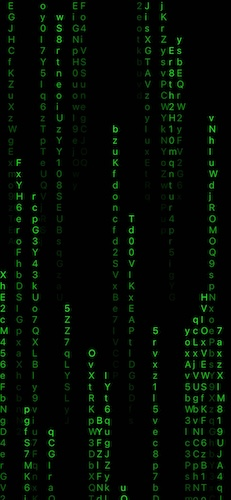

# TMRain - Matrix Rain Effect

一个用 Swift 编写的矩阵雨效果应用，模拟《黑客帝国》中经典的绿色字符雨效果。

## 功能特点

- 🌧️ 流畅的矩阵雨动画效果
- 🎨 经典的绿色字符显示
- ⚡ 可自定义的动画速度和字符密度
- 📱 支持 iOS 设备，自适应屏幕尺寸

## 技术实现

- **语言**: Swift
- **框架**: UIKit
- **核心组件**:
  - `MatrixRainView`: 主要的雨滴效果视图
  - `MatrixColumn`: 单列字符管理类
  - 使用 `CADisplayLink` 实现流畅动画

## 效果预览

## 如何运行

1. 使用 Xcode 打开 `TMRain.xcodeproj`
2. 选择目标设备或模拟器
3. 点击运行按钮 (⌘+R)

## 自定义配置

你可以在 `MatrixRainView.swift` 中调整以下参数：

- `fontSize`: 字符大小 (默认: 16)
- `preferredFramesPerSecond`: 动画帧率 (默认: 15)
- `characterSet`: 显示的字符集合
- `trailLength`: 字符尾迹长度 (10-30)
- `speed`: 下落速度 (1-3)

## 许可证

MIT License
